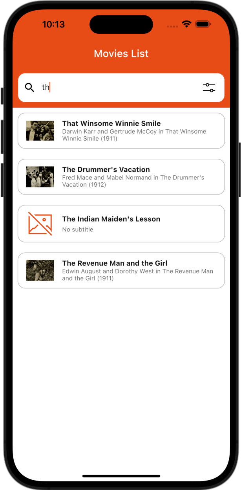
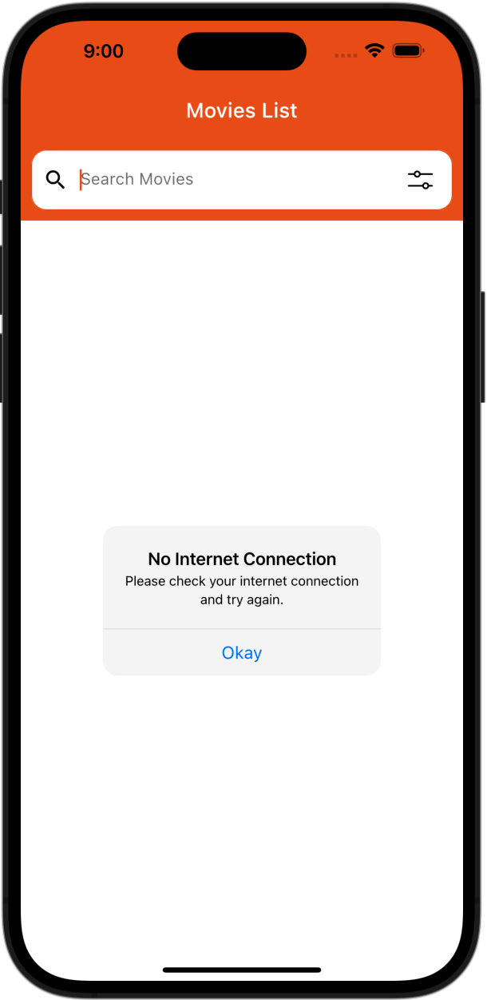
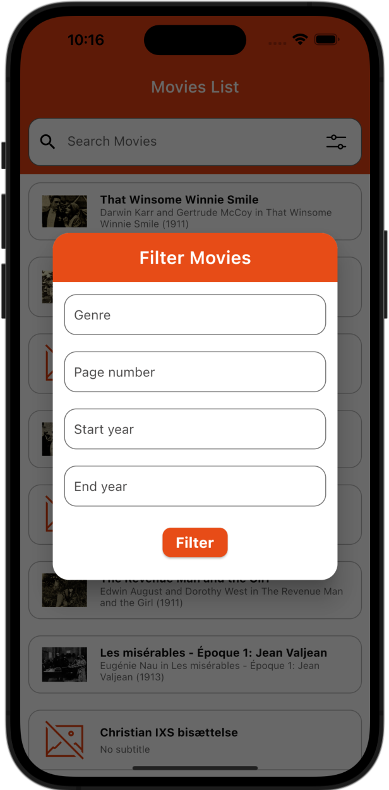
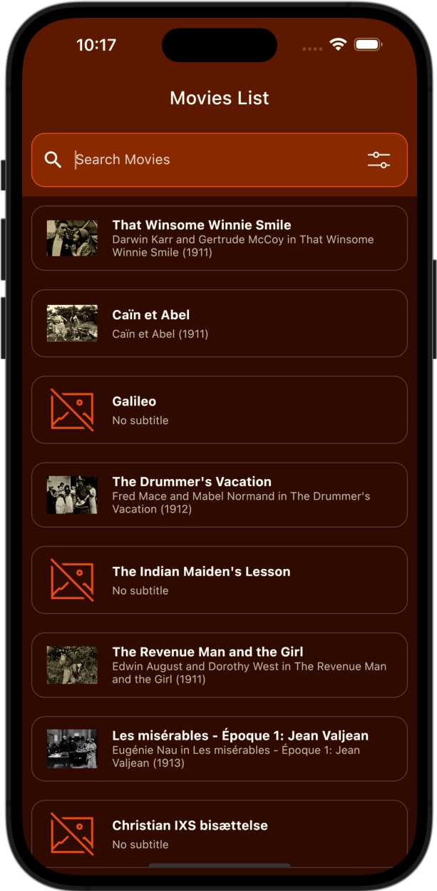
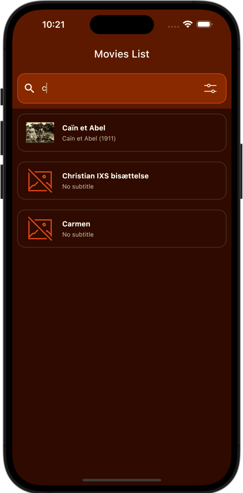
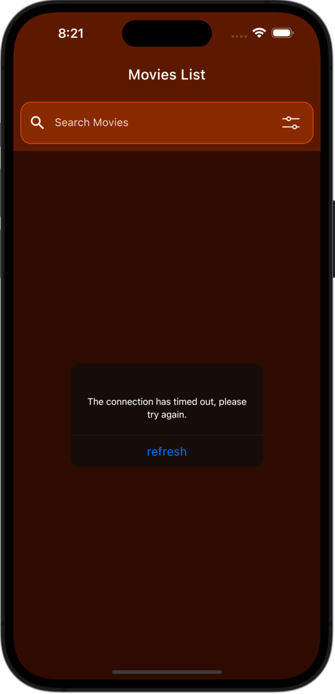
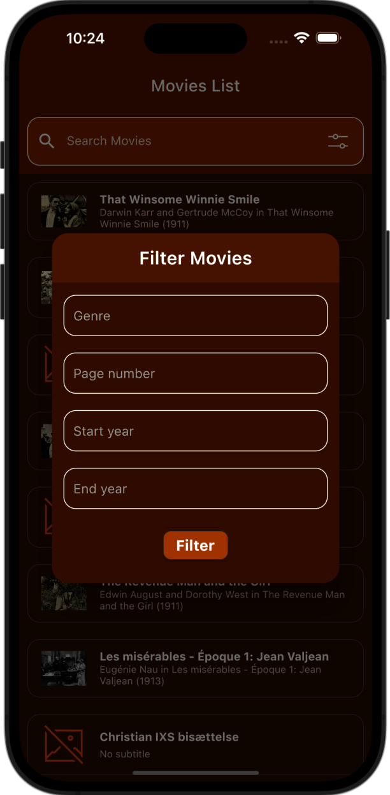
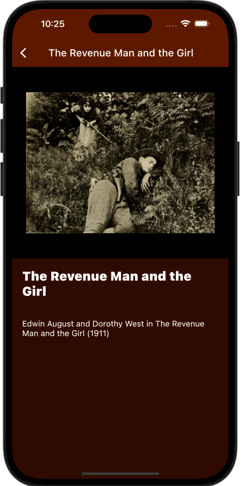

# Flutter Task

I used rapidapi on the service side. The database I am using is MoviesDatabase. API key. Base url ... is encrypted with dotenv.

The video file contains the video of the application. :)

<h1>Movie Light Theme</h1>
<table border="0">
    <tr>
        <td>
            
        </td>
        <td>
            
        </td>
        <td>
            
        </td>
    </tr>
     <tr>
        <td>
            
        </td>
        <td>
            
        </td>
        <td>
            
        </td>
    </tr>
</table>

<h1>Movie Dark Theme</h1>
<table border="1">
    <tr>
        <td>
             
        </td>       
        <td>
            
        </td>
         <td>
            
        </td>
    </tr>
     <tr>
        <td>
             
        </td>       
        <td>
            
        </td>
         <td>
            
        </td>
    </tr>
    
</table>

